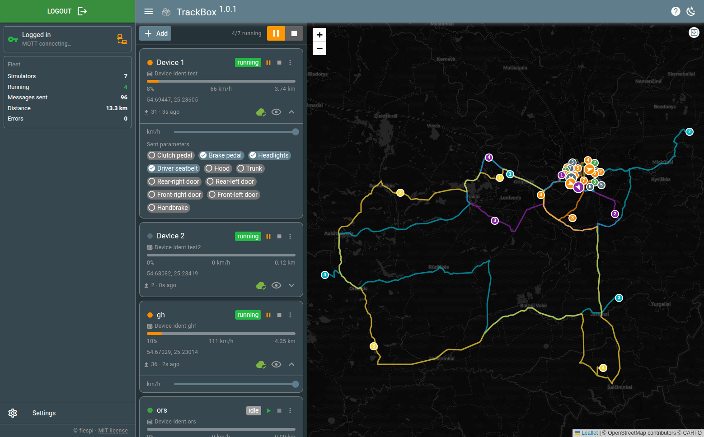

# TrackBox

GPS tracker **simulator** for [flespi](https://flespi.com). Drive virtual devices
along a route and stream their positions into flespi in real time. Run several
simulators at once and watch them move on a live map.

Built on Quasar 2 / Vue 3 / Pinia + `flespi-io-js`.



## What it does

- Load a route from a file (**flespi messages JSON**, **GeoJSON**, **GPX**, or **KML**;
  format auto-detected) or build one by clicking roads. A sample route is built in.
- Move a virtual device along it — constant speed, or timestamp replay with an adjustable
  `×` multiplier — emitting flespi GPS messages on a configurable interval.
- Send into flespi three ways: **Device (REST)**, **HTTP channel**, or **MQTT channel**.
- Run **multiple simulators** at once, each with its own route, target, colour, speed,
  and vehicle-state parameters; control them individually or all together.
- Definitions and playback state are persisted (IndexedDB) and restored on reload, with
  optional per-flow cloud sync via the flespi MQTT broker.

For how it all works internally, see **[docs/architecture.md](docs/architecture.md)**.

## Quick start

1. `npm install`, then `npm run dev` (dev server on **:8190**).
2. Log in with a flespi token via the **login** button in the left drawer.
3. **Add simulator** → upload or build a route, choose the send method and target, set
   speed / interval, **Save**.
4. Press **▶** on a card (or the play-all control) and watch the markers move; check the
   data arriving in your flespi device's messages/telemetry.

## Build targets

One codebase ships as a website, a PWA, and a desktop app.

| Target | Dev | Build | Output |
|--------|-----|-------|--------|
| **SPA** (website) | `npm run dev` | `npm run build` | `dist/spa` |
| **PWA** | `npm run dev:pwa` | `npm run build:pwa` | `dist/pwa` |
| **Tauri** (desktop) | `npm run tauri:dev` | `npm run tauri:build` | `src-tauri/target/release/bundle` |

The dev server port is **8190** (`quasar.config.js` → `devServer.port`; also
`src-tauri/tauri.conf.json` → `build.devUrl`).

### Portable Linux AppImage

`npm run tauri:build` links against the host's glibc, so build the AppImage inside an
Ubuntu 24.04 LTS container for portability:

```bash
scripts/build-appimage.sh                 # builds the image (first run) + the AppImage
scripts/build-appimage.sh --rebuild       # force-rebuild the builder image
ENGINE=podman scripts/build-appimage.sh   # rootless: no sudo chown needed
```

Output: `src-tauri/target/release/bundle/appimage/TrackBox_<version>_amd64.AppImage`.
The non-obvious bits this handles (crossorigin strip, libwayland repack, glibc) are
covered in [docs/architecture.md](docs/architecture.md#desktop--appimage).

## Scripts

```bash
npm run dev        # quasar dev (SPA)
npm run dev:pwa    # quasar dev in PWA mode
npm run build      # SPA build
npm run build:pwa  # PWA build
npm run tauri:dev  # desktop app (dev)
npm run tauri:build# desktop app (installers)
npm run lint
npm run format
```

## License

MIT — see [LICENSE](LICENSE).
